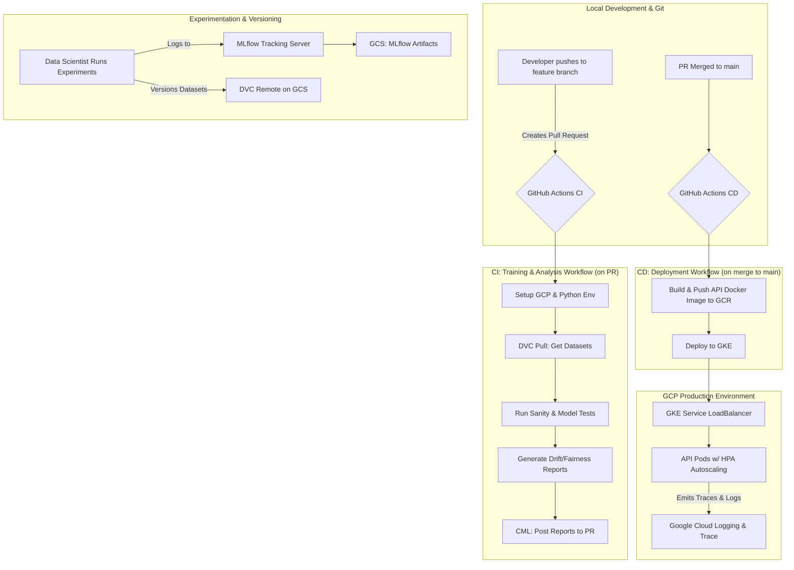

# End-to-End MLOps Pipeline for Production-Grade Fraud Detection

This repository contains a complete, production-grade MLOps pipeline for a financial fraud detection model. The project demonstrates a full lifecycle approach to machine learning, incorporating best practices for data versioning, advanced experiment tracking, CI/CD, containerized deployment on Kubernetes, and comprehensive model analysis.

## ✨ Core Features

-   **Data & Model Versioning**: Utilizes **DVC** for reproducible data and model version control, integrated with Google Cloud Storage.
-   **Experiment Tracking**: Leverages **MLflow** as a central hub to track, compare, and visualize all experiments, including model parameters, metrics, and artifacts.
-   **CI/CD Automation**: Implements robust CI/CD workflows using **GitHub Actions** and **CML** (Continuous Machine Learning) for automated testing, analysis, and deployment.
-   **Containerization**: The inference API is built with **FastAPI** and containerized using **Docker** for portability and scalability.
-   **Scalable Deployment**: Deploys the model as a microservice on **Google Kubernetes Engine (GKE)**, complete with autoscaling capabilities (HPA).
-   **Observability & Monitoring**: Features structured JSON logging and distributed tracing with **OpenTelemetry**, fully integrated with Google Cloud's Operations Suite (Logging & Trace).
-   **Load Testing**: Designed for performance validation using **Locust** or **wrk** to trigger and test the Horizontal Pod Autoscaler (HPA).

### Advanced Model Analysis

The pipeline includes dedicated experiments for in-depth model validation:

-   🛡️ **Data Poisoning Attacks**: Simulates adversarial attacks by poisoning the training data to measure model robustness and performance degradation.
-   ⚖️ **Fairness & Explainability**: Audits the model for bias across synthetic sensitive groups using **Fairlearn** and explains individual predictions with **SHAP**.
-   🌊 **Data Drift Detection**: Proactively monitors for feature and target distribution shifts between datasets using **Evidently AI**.

## 🏗️ Solution Architecture

The pipeline is split into two main automated workflows: Continuous Integration (CI) for testing and analysis on pull requests, and Continuous Deployment (CD) for releasing the model to production upon merging to the main branch.



## 🚀 Getting Started: Setup and Installation

Follow these steps to set up the project environment. These commands should be run in **Google Cloud Shell**.

### 1. Clone the Repository

```bash
git clone https://github.com/Soumya0927/End-To-End-MLOps-Pipeline.git
cd End-To-End-MLOps-Pipeline
```

### 2. Configure Environment Variables

Create a `setup_env.sh` script with the following content and run it. This will configure your session.

```bash
#!/bin/bash

# --- User-configurable variables ---
export PROJECT_ID="your-gcp-project-id"
export REGION="your-gcp-project-region"
export GITHUB_REPO_OWNER="Soumya0927"
export GITHUB_REPO_NAME="End-To-End-MLOps-Pipeline"
# --- End of user-configurable variables ---

# --- Standardized Naming Convention ---
export BASE_NAME="mlops"
export GKE_CLUSTER_NAME="${BASE_NAME}-cluster"
export ARTIFACT_REPO_NAME="${BASE_NAME}-repo"
export K8S_NAMESPACE="${BASE_NAME}"
export DVC_BUCKET="gs://${BASE_NAME}-dvc-store"
export MLFLOW_BUCKET="gs://${BASE_NAME}-mlflow-artifacts"
export GITHUB_REPO="${GITHUB_REPO_OWNER}/${GITHUB_REPO_NAME}"
export PIPELINE_SA_NAME="mlops-pipeline-sa"
export PIPELINE_SA_EMAIL="${PIPELINE_SA_NAME}@${PROJECT_ID}.iam.gserviceaccount.com"

# --- Configure gcloud CLI ---
gcloud config set project $PROJECT_ID
gcloud config set compute/region $REGION

echo "Environment setup complete. You can now run the provisioning script."
```

**Make it executable and source it:**
```bash
chmod +x setup_env.sh
source ./setup_env.sh
```

### 3. Set Up Local Python Environment

Using a dedicated Conda environment is crucial to manage dependencies.

```bash
conda create -n mlops-pipeline python=3.10 -y
conda activate mlops-pipeline
```

### 4. Install Dependencies

```bash
pip install -r requirements.txt
```

### 5. Configure and Pull DVC Data

Point DVC to your Google Cloud Storage bucket and pull the initial dataset.

```bash
# Configure DVC to use your GCS bucket
dvc remote add -d gcs ${DVC_BUCKET}
dvc remote modify gcs projectname $PROJECT_ID

# Pull the versioned data
dvc pull
```

## 🔬 How to Run the Experiments

All experiments are tracked using MLflow. Start the MLflow UI first to visualize the results in real-time.

```bash
# Start the MLflow server in a separate terminal (e.g., using 'screen')
# The backend-store-uri and default-artifact-root should point to your GCP resources.
mlflow server \
    --backend-store-uri sqlite:///mlflow.db \
    --default-artifact-root ${MLFLOW_BUCKET} \
    --host 0.0.0.0 \
    --port 8000
```

### 1. Run the DVC Pipeline

This command executes the entire data processing pipeline defined in `dvc.yaml`, from downloading to splitting the data.

```bash
dvc repro
```

### 2. Train the Baseline Model

This script trains the initial model on `version_1` of the data and logs all results to MLflow.

```bash
python src/train.py --mlflow-uri http://localhost:8000
```

### 3. Data Poisoning Impact Analysis

This experiment analyzes the model's robustness against adversarial data poisoning attacks.

```bash
python src/poison_experiment.py --mlflow-uri http://localhost:8000
```
**Output**: A new experiment in MLflow named "Data Poisoning Analysis" with a run for each poison level and a final summary report.

### 4. Fairness & Explainability Analysis

This script audits the model for fairness and generates SHAP plots for explainability.

```bash
python src/fairness_experiment.py --mlflow-uri http://localhost:8000
```
**Output**: A run in the "Fairness and Explainability" experiment containing a detailed HTML fairness report and SHAP plots as artifacts.

### 5. Data Drift Detection

This script compares `version_1` (training) and `version_2` (production) data to detect feature and target drift.

```bash
python src/detect_drift.py --mlflow-uri http://localhost:8000
```
**Output**: An interactive HTML drift report logged to the "Data Drift Analysis" experiment in MLflow.


## 🚢 Deployment to Google Kubernetes Engine (GKE)

The trained model is deployed as a containerized API on GKE.

### 1. Build and Push the Docker Image with Cloud Build

Using Cloud Build is the recommended, secure way to build and push images.

```bash
# Ensure your environment variables are set from setup_env.sh
export IMAGE_NAME="${REGION}-docker.pkg.dev/${PROJECT_ID}/${ARTIFACT_REPO_NAME}/fraud-detector"
export IMAGE_TAG="latest"

gcloud builds submit . --tag="${IMAGE_NAME}:${IMAGE_TAG}"
```

### 2. Deploy to GKE

The GitHub Actions CD pipeline automates this step on merge to `main`. To do it manually:

```bash
# Get cluster credentials
gcloud container clusters get-credentials $GKE_CLUSTER_NAME --zone ${REGION}-a

# Apply all Kubernetes manifests to the correct namespace
# IMPORTANT: First, ensure your k8s/deployment.yaml uses the correct image path from the previous step.
kubectl apply -f k8s/ -n $K8S_NAMESPACE
```

This will create the Deployment, Service, HorizontalPodAutoscaler, and ServiceAccount defined in the `k8s/` directory.

### 3. Load Testing

Once the service is deployed and has an external IP, you can trigger the autoscaler with a load testing tool like **wrk**.

#### a. Get Service IP

```bash
kubectl get service -n $K8S_NAMESPACE
```

#### b. Install wrk

On Debian/Ubuntu:
```bash
sudo apt-get update && sudo apt-get install -y wrk
```

#### c. Create `post.lua` for POST Requests

`wrk` needs a Lua script to send POST requests with a JSON body. Create a file named `post.lua` with sample data:

```lua
-- post.lua
wrk.method = "POST"
wrk.headers["Content-Type"] = "application/json"
wrk.body = '{"Time": 50554, "V1": -0.79, "V2": 1.18, "V3": 0.90, "V4": 0.69, "V5": 0.21, "V6": -0.31, "V7": 0.49, "V8": 0.13, "V9": -0.76, "V10": 0.17, "V11": 0.82, "V12": 0.46, "V13": -0.05, "V14": 0.57, "V15": 0.35, "V16": -0.01, "V17": -0.50, "V18": 0.72, "V19": 0.86, "V20": -0.08, "V21": 0.20, "V22": 0.57, "V23": -0.09, "V24": 0.01, "V25": -0.24, "V26": -0.38, "V27": -0.39, "V28": -0.11, "Amount": 4.18}'
```

#### d. Run the Load Test

Execute `wrk`, pointing it to your service's external IP. This command runs a test for 60 seconds using 4 threads and maintaining 100 concurrent connections.

```bash
# Replace YOUR_EXTERNAL_IP with the actual IP
wrk -t4 -c100 -d60s --latency -s post.lua http://YOUR_EXTERNAL_IP/predict
```
While the test runs, monitor the pod scaling with `kubectl get hpa -n $K8S_NAMESPACE -w`.

## 🛠️ Technology Stack

- **Machine Learning**: Python, Scikit-learn, LightGBM, Pandas
- **Experiment Tracking**: MLflow
- **Data Versioning**: DVC
- **CI/CD**: GitHub Actions, CML
- **API Framework**: FastAPI
- **Containerization**: Docker
- **Orchestration**: Kubernetes (GKE)
- **Cloud Platform**: Google Cloud Platform (GCS, GKE, Artifact Registry)
- **Monitoring**: OpenTelemetry, Google Cloud Operations Suite
- **Model Analysis**: SHAP, Fairlearn, Evidently AI

## 🤝 Contributing

1.  Fork the repository.
2.  Create a feature branch (`git checkout -b feature/amazing-feature`).
3.  Commit your changes (`git commit -m 'Add some amazing feature'`).
4.  Push to the branch (`git push origin feature/amazing-feature`).
5.  Open a Pull Request.

## 📄 License

This project is licensed under the MIT License - see the `LICENSE` file for details.
